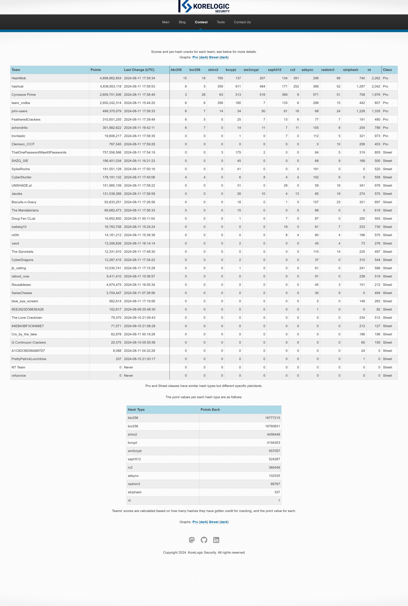
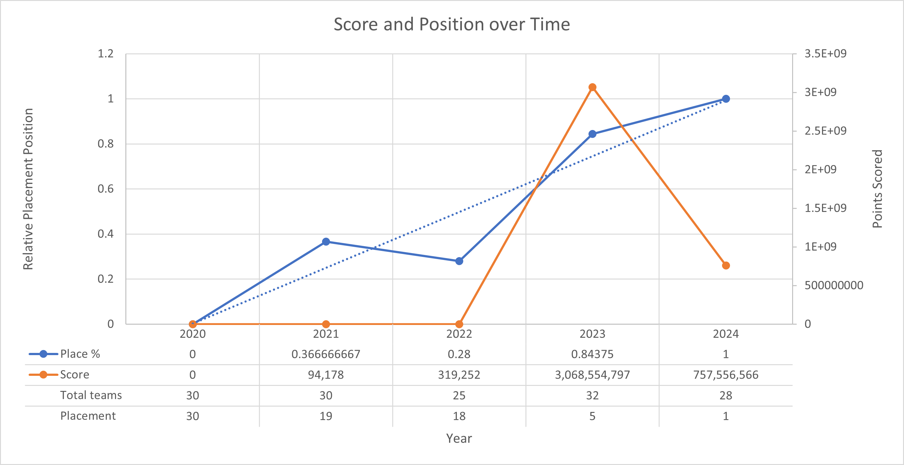
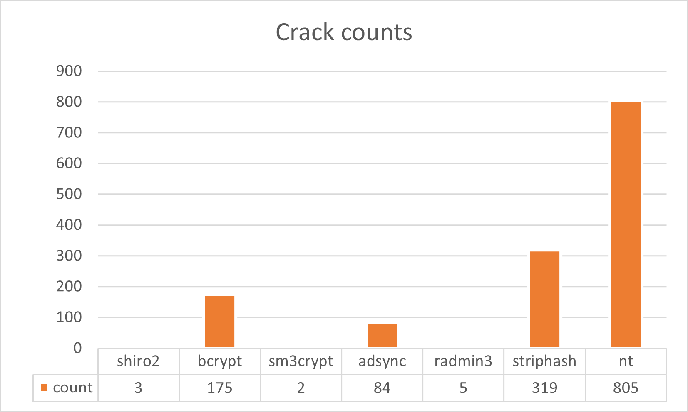
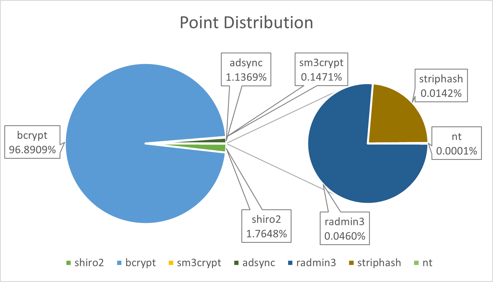

## Info

> What: The premier annual password cracking contest sponsored by KoreLogic.
>
> Where: DEF CON 32 - Las Vegas, NV, USA, and over the Internet.
>
> When: 48 hours, from 11 AM Las Vegas time (US/Pacific) Friday, August 9th, 2024 to 11 AM LV time Sunday, August 11th.
>
> Who: Anyone can play. Teams of people will do best.
>
> Why: To help push the envelope of password cracking techniques / methodologies and to challenge password crackers' skills.
>
>
> Copyright 2024. KoreLogic Security. All rights reserved
>
>
> All Crack Me IF You Can contents originally under copyright for KoreLogic
> Security. All contest hashes and contents created and owned by Korelogic,
> and ownership belongs to them.

Link to contest website: [CMIYC 2024](https://contest-2024.korelogic.com/)

See prior years' contents at [korelogic's contents archive](https://contest.korelogic.com/).

Huge shoutout to Korelogic for keeping up all the way back to **2010**!!!! (One of my
goals for "offseason" this year is to go back and grab all the prior years
values and spend some time on each and noting what my experience/take
aways are for each - stay tuned to this org for future updates on that
endeavor.

## [Contest Hashes](https://contest-2024.korelogic.com/downloads.html)

Download directly from korelogic's site.

Alternatively, they are also mirrored in this repo in [contest_hashes](https://github.com/ThatOnePasswordWas40Passwords/crackmeifyoucan/tree/main/2024/contest_hashes).

## [Results](https://contest-2024.korelogic.com/stats.html)

I [^1] took 1st in the street division this year finally! This was a goal of
mine since the first time I competed (_which was, checks clock, **5 years ago**_
ha ha). This year's contest was a brutal slog. I learned some new things,
had another chance to learn how bad my work management capabilities are,
and most importantly, had fun as always.

[^1]: ThatOnePasswordWas40Passwords is a team of just myself. Though this
      year, I had someone decrypt the PCAP file and extract all the passwords
      from it and send those to me. So I wasn't _entirely_ solo. But
      my position and scoring would not have changed much if that hadn't
      been involved, since it really only gave me a handful of
      re-used passwords in the form of other hashes ... and, on top of
      that, I already knew how to get the handshake/decrypt etc. the PCAP
      but for whatever reason I couldn't get my WSL wireshark working
      this past weekend /shrug.

Score board glory:

### Progression tangent

I want to take a minute to talk not necessarily about this year's contest,
but as my experience with CMIYC as a whole over the last five years. If
you don't care and just want to skip ahead, go to [takeaways](#takeaways).

Before I got into participating in CMIYC I regularly participated in assorted
CTFs as part of the [burner_herz0g](https://ctftime.org/team/63292/) team
I helped lead. On top of that, I regularly played on miscellaneous training
sites like HackTheBox, TryHackMe, cryptopals, etc. My engagement in
cybersecurity focused things has (for now, at least? hit me up with any
opportunies?:)) been only for personal reasons. I'm a developer
professionally; the cybersecurity activities simply started as a way
to stay up to date on important topics that impact my day-day practices.
Overtime, it grew into a passion, as I got more and more exposed to
various fields within cybersecurity. Particularly, the the puzzle-like
nature of cracking really intrigued me, and I quickly got addicted to
the bliss that is seeing a running hashcat session spit out a crack.

My first year competing in CMIYC was [2020](https://contest-2020.korelogic.com/stats.html),
where I was still registering under our CTF team's burner_herz0g name.
After the contest, I had scored a whopping _**0 points**_. Despite this,
I still had a fun time, and was determined to score at least a single
point the next year.

[2021](https://contest-2021.korelogic.com/stats.html) rolls around and
that year I managed to score 94,178 points over 27,557 total hashes.
Most definitely better than 2020, good enough for 19/30. My goal of
continually improving had been met, and I was even more excited by the
competition.

This story continued through 2022, 2023, finally culminating in 2024's performance.

[2024](https://contest-2024.korelogic.com/stats.html) I achieved my ultimate goal ending a 5 year journey. Below is a
graph showing my placement over the years:

> Includes scoring, though that isn't really useful.

All in all, its been a great journey. I've learned quite a bit about
the process, tools, and ideas around cracking, and like to think I'd
have a good chance at most real life situations now.

As for the upcoming year(s) - I'm not sure whats next. Maybe time to
"go pro" (just need the bus carrying team hashcat, cynosure prime,
hashmob, and john-users to get lost on the way to Defcon that year...).
Maybe stay in street and make the new goal staying top as long as
possible. Maybe its time to make some friends and focus less on
solo-ing the challenge and trying to form a team to help each other
learn and grow.

Either way - I already have some plans for practice in
the meantime. Keep an eye out on my [Github Organization](https://github.com/ThatOnePasswordWas40Passwords)
and/or [Github account, bigpick](https://github.com/bigpick) for any
future updates on those.

**If anything I've mentioned sounds interesting to you, or you're
interested in _me_, drop me an issue to chat - I promise I'm friendly:)**

---

  
&nbsp; &nbsp;
  

&nbsp;

## Takeaways

> Takeaways, notes, errata, etc.

### tl;dr

1. Being able to pivot is as critical as always.
2. GPU (or CPU) power didn't seem to matter much.
3. Meticuluous use of hashcat's `--potfile-path` made per-hash-type crack
   tracking _way_ easier this year.
4. Hints played a huge part.
    * Wish they had a planned/advertised-ahead-of-time drop schedule.
5. Need to actually follow through on off-season plans before next year.

To see the rest of the technical writeup, read it from its original source:

* <https://github.com/ThatOnePasswordWas40Passwords/crackmeifyoucan/tree/main/2024>
